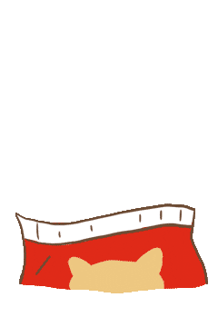
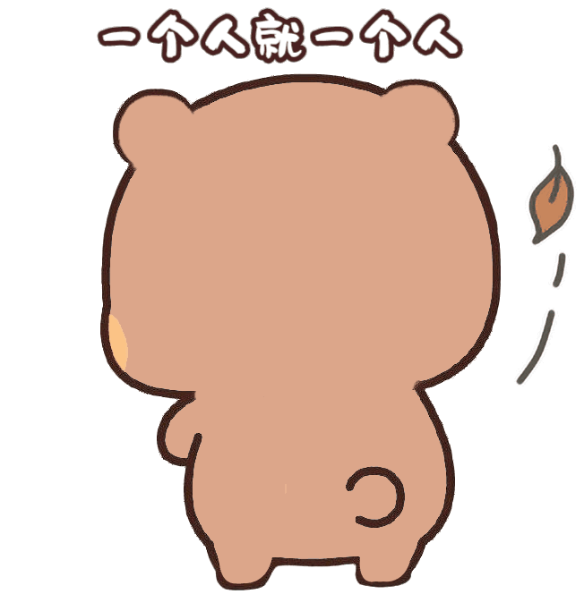

# emoiji-collection

表情包资源分享，目前只有一二的表情包资源。

提供了处理程序用于整理表情包数据，可用于快速导入评论系统

[main.go](./process/main.go)

## 一二所有表情包预览

---
<table>
    <tr>
        <td>
          </img>
        </td>
        <td>
          </img>
        </td>
        <td>
          </img>
        </td>
        <td>
          </img>
        </td>
        <td>
          </img>
        </td>
        <td>
          </img>
        </td>
        <td>
          </img>
        </td>
        <td>
          </img>
        </td>
        <td>
          </img>
        </td>
        <td>
          </img>
        </td>
    </tr>
    <tr>
        <td>
          </img>
        </td>
        <td>
          </img>
        </td>
        <td>
          </img>
        </td>
        <td>
          </img>
        </td>
        <td>
          </img>
        </td>
        <td>
          </img>
        </td>
        <td>
          </img>
        </td>
        <td>
          </img>
        </td>
        <td>
          </img>
        </td>
        <td>
          </img>
        </td>
    </tr>
    <tr>
        <td>
          </img>
        </td>
        <td>
          </img>
        </td>
        <td>
          </img>
        </td>
        <td>
          </img>
        </td>
        <td>
          </img>
        </td>
        <td>
          </img>
        </td>
        <td>
          </img>
        </td>
        <td>
          </img>
        </td>
        <td>
          </img>
        </td>
        <td>
          </img>
        </td>
    </tr>
    <tr>
        <td>
          </img>
        </td>
        <td>
          </img>
        </td>
        <td>
          </img>
        </td>
        <td>
          </img>
        </td>
        <td>
          </img>
        </td>
        <td>
          </img>
        </td>
        <td>
          </img>
        </td>
        <td>
          </img>
        </td>
        <td>
          </img>
        </td>
        <td>
          </img>
        </td>
    </tr>
    <tr>
        <td>
          </img>
        </td>
        <td>
          </img>
        </td>
        <td>
          </img>
        </td>
        <td>
          </img>
        </td>
        <td>
          </img>
        </td>
        <td>
          </img>
        </td>
        <td>
          </img>
        </td>
        <td>
          </img>
        </td>
        <td>
          </img>
        </td>
        <td>
          </img>
        </td>
    </tr>
    <tr>
        <td>
          </img>
        </td>
        <td>
          </img>
        </td>
        <td>
          </img>
        </td>
        <td>
          </img>
        </td>
        <td>
          </img>
        </td>
        <td>
          </img>
        </td>
        <td>
          </img>
        </td>
        <td>
          </img>
        </td>
        <td>
          </img>
        </td>
        <td>
          </img>
        </td>
    </tr>
    <tr>
        <td>
          </img>
        </td>
        <td>
          </img>
        </td>
        <td>
          </img>
        </td>
        <td>
          </img>
        </td>
        <td>
          </img>
        </td>
        <td>
          </img>
        </td>
        <td>
          </img>
        </td>
        <td>
          </img>
        </td>
        <td>
          </img>
        </td>
        <td>
          </img>
        </td>
    </tr>
    <tr>
        <td>
          </img>
        </td>
        <td>
          </img>
        </td>
        <td>
          </img>
        </td>
        <td>
          </img>
        </td>
        <td>
          </img>
        </td>
        <td>
          </img>
        </td>
        <td>
          </img>
        </td>
        <td>
          </img>
        </td>
        <td>
          </img>
        </td>
        <td>
          </img>
        </td>
    </tr>
    <tr>
        <td>
          </img>
        </td>
        <td>
          </img>
        </td>
        <td>
          </img>
        </td>
        <td>
          </img>
        </td>
        <td>
          </img>
        </td>
        <td>
          </img>
        </td>
        <td>
          </img>
        </td>
        <td>
          </img>
        </td>
        <td>
          </img>
        </td>
        <td>
          </img>
        </td>
    </tr>
    <tr>
        <td>
          </img>
        </td>
        <td>
          </img>
        </td>
        <td>
          </img>
        </td>
        <td>
          </img>
        </td>
        <td>
          </img>
        </td>
        <td>
          </img>
        </td>
        <td>
          </img>
        </td>
        <td>
          </img>
        </td>
        <td>
          </img>
        </td>
        <td>
          </img>
        </td>
    </tr>
    <tr>
        <td>
          </img>
        </td>
        <td>
          </img>
        </td>
        <td>
          </img>
        </td>
        <td>
          </img>
        </td>
        <td>
          </img>
        </td>
        <td>
          </img>
        </td>
        <td>
          </img>
        </td>
        <td>
          </img>
        </td>
        <td>
          </img>
        </td>
        <td>
          </img>
        </td>
    </tr>
    <tr>
        <td>
          </img>
        </td>
        <td>
          </img>
        </td>
        <td>
          </img>
        </td>
        <td>
          </img>
        </td>
        <td>
          </img>
        </td>
        <td>
          </img>
        </td>
        <td>
          </img>
        </td>
        <td>
          </img>
        </td>
        <td>
          </img>
        </td>
        <td>
          </img>
        </td>
    </tr>
    <tr>
        <td>
          </img>
        </td>
        <td>
          </img>
        </td>
        <td>
          </img>
        </td>
        <td>
          </img>
        </td>
        <td>
          </img>
        </td>
        <td>
          </img>
        </td>
        <td>
          </img>
        </td>
        <td>
          </img>
        </td>
        <td>
          </img>
        </td>
        <td>
          </img>
        </td>
    </tr>
    <tr>
        <td>
          </img>
        </td>
        <td>
          </img>
        </td>
        <td>
          </img>
        </td>
        <td>
          </img>
        </td>
        <td>
          </img>
        </td>
        <td>
          </img>
        </td>
        <td>
          </img>
        </td>
        <td>
          </img>
        </td>
        <td>
          </img>
        </td>
        <td>
          </img>
        </td>
    </tr>
    <tr>
        <td>
          </img>
        </td>
        <td>
          </img>
        </td>
        <td>
          </img>
        </td>
        <td>
          </img>
        </td>
        <td>
          </img>
        </td>
        <td>
          </img>
        </td>
        <td>
          </img>
        </td>
        <td>
          </img>
        </td>
        <td>
          </img>
        </td>
        <td>
          </img>
        </td>
    </tr>
    <tr>
        <td>
          </img>
        </td>
        <td>
          </img>
        </td>
        <td>
          </img>
        </td>
        <td>
          </img>
        </td>
        <td>
          </img>
        </td>
        <td>
          </img>
        </td>
        <td>
          </img>
        </td>
        <td>
          </img>
        </td>
        <td>
          </img>
        </td>
        <td>
          </img>
        </td>
    </tr>
    <tr>
        <td>
          </img>
        </td>
        <td>
          </img>
        </td>
        <td>
          </img>
        </td>
        <td>
          </img>
        </td>
        <td>
          </img>
        </td>
        <td>
          </img>
        </td>
        <td>
          </img>
        </td>
        <td>
          </img>
        </td>
        <td>
          </img>
        </td>
        <td>
          </img>
        </td>
    </tr>
    <tr>
        <td>
          </img>
        </td>
        <td>
          </img>
        </td>
        <td>
          </img>
        </td>
        <td>
          </img>
        </td>
        <td>
          </img>
        </td>
        <td>
          </img>
        </td>
        <td>
          </img>
        </td>
        <td>
          </img>
        </td>
        <td>
          </img>
        </td>
        <td>
          </img>
        </td>
    </tr>
    <tr>
        <td>
          </img>
        </td>
        <td>
          </img>
        </td>
        <td>
          </img>
        </td>
        <td>
          </img>
        </td>
        <td>
          </img>
        </td>
        <td>
          </img>
        </td>
        <td>
          </img>
        </td>
        <td>
          </img>
        </td>
        <td>
          </img>
        </td>
        <td>
          </img>
        </td>
    </tr>
    <tr>
        <td>
          </img>
        </td>
        <td>
          </img>
        </td>
        <td>
          </img>
        </td>
        <td>
          </img>
        </td>
        <td>
          </img>
        </td>
        <td>
          </img>
        </td>
        <td>
          </img>
        </td>
        <td>
          </img>
        </td>
        <td>
          </img>
        </td>
        <td>
          </img>
        </td>
    </tr>
    <tr>
        <td>
          </img>
        </td>
        <td>
          </img>
        </td>
        <td>
          </img>
        </td>
        <td>
          </img>
        </td>
        <td>
          </img>
        </td>
        <td>
          </img>
        </td>
        <td>
          </img>
        </td>
        <td>
          </img>
        </td>
        <td>
          </img>
        </td>
        <td>
          </img>
        </td>
    </tr>
    <tr>
        <td>
          </img>
        </td>
        <td>
          </img>
        </td>
        <td>
          </img>
        </td>
        <td>
          </img>
        </td>
        <td>
          </img>
        </td>
        <td>
          </img>
        </td>
        <td>
          </img>
        </td>
        <td>
          </img>
        </td>
        <td>
          </img>
        </td>
        <td>
          </img>
        </td>
    </tr>
    <tr>
        <td>
          </img>
        </td>
        <td>
          </img>
        </td>
        <td>
          </img>
        </td>
        <td>
          </img>
        </td>
        <td>
          </img>
        </td>
        <td>
          </img>
        </td>
        <td>
          </img>
        </td>
        <td>
          </img>
        </td>
        <td>
          </img>
        </td>
        <td>
          </img>
        </td>
    </tr>
    <tr>
        <td>
          </img>
        </td>
        <td>
          </img>
        </td>
        <td>
          </img>
        </td>
        <td>
          </img>
        </td>
        <td>
          </img>
        </td>
        <td>
          </img>
        </td>
        <td>
          </img>
        </td>
        <td>
          </img>
        </td>
        <td>
          </img>
        </td>
        <td>
          </img>
        </td>
    </tr>
    <tr>
        <td>
          </img>
        </td>
        <td>
          </img>
        </td>
        <td>
          </img>
        </td>
        <td>
          </img>
        </td>
        <td>
          </img>
        </td>
        <td>
          </img>
        </td>
        <td>
          </img>
        </td>
        <td>
          </img>
        </td>
        <td>
          </img>
        </td>
        <td>
          </img>
        </td>
    </tr>
    <tr>
        <td>
          </img>
        </td>
        <td>
          </img>
        </td>
        <td>
          </img>
        </td>
        <td>
          </img>
        </td>
        <td>
          </img>
        </td>
        <td>
          </img>
        </td>
        <td>
          </img>
        </td>
        <td>
          </img>
        </td>
        <td>
          </img>
        </td>
        <td>
          </img>
        </td>
    </tr>
    <tr>
        <td>
          </img>
        </td>
        <td>
          </img>
        </td>
        <td>
          </img>
        </td>
        <td>
          </img>
        </td>
        <td>
          </img>
        </td>
        <td>
          </img>
        </td>
        <td>
          </img>
        </td>
        <td>
          </img>
        </td>
        <td>
          </img>
        </td>
        <td>
          </img>
        </td>
    </tr>
    <tr>
        <td>
          </img>
        </td>
        <td>
          </img>
        </td>
        <td>
          </img>
        </td>
        <td>
          </img>
        </td>
        <td>
          </img>
        </td>
        <td>
          </img>
        </td>
        <td>
          </img>
        </td>
        <td>
          </img>
        </td>
        <td>
          </img>
        </td>
        <td>
          </img>
        </td>
    </tr>
    <tr>
        <td>
          </img>
        </td>
        <td>
          </img>
        </td>
        <td>
          </img>
        </td>
        <td>
          </img>
        </td>
        <td>
          </img>
        </td>
        <td>
          </img>
        </td>
        <td>
          </img>
        </td>
        <td>
          </img>
        </td>
        <td>
          </img>
        </td>
        <td>
          </img>
        </td>
    </tr>
    <tr>
        <td>
          </img>
        </td>
        <td>
          </img>
        </td>
        <td>
          </img>
        </td>
        <td>
          </img>
        </td>
        <td>
          </img>
        </td>
        <td>
          </img>
        </td>
        <td>
          </img>
        </td>
        <td>
          </img>
        </td>
        <td>
          </img>
        </td>
        <td>
          </img>
        </td>
    </tr>
    <tr>
        <td>
          </img>
        </td>
        <td>
          </img>
        </td>
        <td>
          </img>
        </td>
        <td>
          </img>
        </td>
        <td>
          </img>
        </td>
        <td>
          </img>
        </td>
        <td>
          </img>
        </td>
        <td>
          </img>
        </td>
        <td>
          </img>
        </td>
        <td>
          </img>
        </td>
    </tr>
    <tr>
        <td>
          </img>
        </td>
        <td>
          </img>
        </td>
        <td>
          </img>
        </td>
        <td>
          </img>
        </td>
        <td>
          </img>
        </td>
        <td>
          </img>
        </td>
        <td>
          </img>
        </td>
        <td>
          </img>
        </td>
        <td>
          </img>
        </td>
        <td>
          </img>
        </td>
    </tr>
    <tr>
        <td>
          </img>
        </td>
        <td>
          </img>
        </td>
        <td>
          </img>
        </td>
        <td>
          </img>
        </td>
        <td>
          </img>
        </td>
        <td>
          </img>
        </td>
        <td>
          </img>
        </td>
        <td>
          </img>
        </td>
        <td>
          </img>
        </td>
        <td>
          </img>
        </td>
    </tr>
    <tr>
        <td>
          </img>
        </td>
        <td>
          </img>
        </td>
    </tr>
</table>

